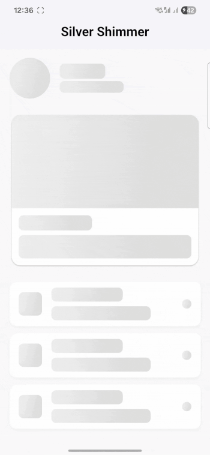

# Silver Shimmer

A customizable Flutter package for creating elegant shimmer loading effects in your applications. Silver Shimmer provides an easy way to add shimmer animations to any widget with flexible configuration options.

## Preview


## Shimmer Customization Option
| Property            | Type               | Default                        | Description                                                             |
| ------------------- | ------------------ |--------------------------------| ----------------------------------------------------------------------- |
| `duration`          | `Duration`         | `Duration(seconds: 2)`         | Base duration of a shimmer cycle (before applying `speedFactor`).       |
| `speedFactor`       | `double`           | `1.0`                          | Multiplies duration to speed up or slow down the animation.             |
| `baseColor`         | `Color`            | `Color(0xFFE0E0E0)`            | The background color of the shimmer.                                    |
| `highlightColor`    | `Color`            | `Color(0xFFF5F5F5)`            | The highlight (glow) color of the shimmer.                              |
| `gradientColors`    | `List<Color>?`     | `null`                         | Optional custom gradient colors (overrides base/highlight if set).      |
| `direction`         | `ShimmerDirection` | `ShimmerDirection.leftToRight` | Direction of shimmer movement (horizontal, vertical, diagonal).         |
| `effect`            | `ShimmerEffect`    | `ShimmerEffect.classic`        | Type of shimmer: `classic`, `wave`, or `pulse`.                         |
| `disableAfter`      | `Duration?`        | `null`                         | Automatically disables shimmer after the specified time.                |
| `shimmerAngle`      | `double?`          | `null`                         | Angle (in degrees) for custom shimmer direction. Overrides `direction`. |
| `shimmerSizeFactor` | `double`           | `1.0`                          | Scales the gradient stops to make shimmer larger/smaller.               |
| `borderRadius`      | `BorderRadius?`    | `8.0`                          | Optional border radius for container shimmer effects (via wrapper).     |

## Features

- Apply shimmer effects to any widget with a simple extension method
- Multiple shimmer effect styles: classic, wave, and pulse
- Customizable shimmer direction (left-to-right, top-to-bottom, diagonal)
- Configurable colors, speed, duration, and angle
- Global theme configuration
- Automatic disabling after a specified duration
- Border radius support for container shimmer effects

## Installation

Add this to your package's `pubspec.yaml` file:

```yaml
dependencies:
  silver_shimmer: ^0.0.1
```

Run:
```dart
flutter pub get
```
## Usage
### Basic Usage
Apply the shimmer effect to any widget using the extension method:

```dart
// Simple Text with shimmer
Text('Loading content...').shimmer(shimmer: isLoading)

// Container with shimmer
Container(
  height: 100,
  color: Colors.grey[300],
).shimmer(shimmer: isLoading)
```

### Global Configuration
Configure default shimmer properties for your entire application:

```dart
void main() {
  ShimmerTheme().update(
    duration: Duration(seconds: 1),
    baseColor: Colors.grey[300]!,
    highlightColor: Colors.grey[100]!,
    direction: ShimmerDirection.leftToRight,
    effect: ShimmerEffect.classic,
  );
  
  runApp(MyApp());
}
```

### Complete Example
```dart
import 'package:flutter/material.dart';
import 'package:silver_shimmer/silver_shimmer.dart';

void main() {
  ShimmerTheme().update(
    duration: Duration(seconds: 3),
    speedFactor: 3.5,
    baseColor: Colors.grey[300]!,
    highlightColor: Colors.grey[100]!,
    direction: ShimmerDirection.leftToRight,
    effect: ShimmerEffect.classic,
    angle: 45,
  );

  runApp(MyApp());
}

class MyApp extends StatefulWidget {
  @override
  _MyAppState createState() => _MyAppState();
}

class _MyAppState extends State<MyApp> {
  bool _isLoading = true;

  @override
  void initState() {
    super.initState();
    // Simulate data loading
    Future.delayed(const Duration(seconds: 5), () {
      setState(() {
        _isLoading = false;
      });
    });
  }

  @override
  Widget build(BuildContext context) {
    return MaterialApp(
      home: Scaffold(
        appBar: AppBar(title: const Text('Silver Shimmer Example')),
        body: Padding(
          padding: const EdgeInsets.all(20.0),
          child: Column(
            crossAxisAlignment: CrossAxisAlignment.start,
            children: [
              Card(
                shape: RoundedRectangleBorder(
                  borderRadius: BorderRadius.circular(15),
                ),
                elevation: 5,
                child: Column(
                  crossAxisAlignment: CrossAxisAlignment.start,
                  children: [
                    ClipRRect(
                      borderRadius: BorderRadius.vertical(top: Radius.circular(15)),
                      child: Container(
                        height: 150,
                        width: double.infinity,
                        color: Colors.grey[300],
                        child: _isLoading
                            ? null
                            : Image.network(
                          'https://source.unsplash.com/300x200/?nature',
                          fit: BoxFit.cover,
                        ),
                      ).shimmer(shimmer: _isLoading),
                    ),
                    Padding(
                      padding: const EdgeInsets.all(10.0),
                      child: Column(
                        crossAxisAlignment: CrossAxisAlignment.start,
                        children: [
                          Text(
                            'Beautiful Nature View',
                            style: TextStyle(fontSize: 18, fontWeight: FontWeight.bold),
                          ).shimmer(shimmer: _isLoading),
                          const SizedBox(height: 10),
                          Text(
                            'This is a sample description of the card content.',
                            style: TextStyle(color: Colors.grey[600]),
                          ).shimmer(shimmer: _isLoading),
                        ],
                      ),
                    ),
                  ],
                ),
              ),
            ],
          ),
        ),
      ),
    );
  }
}

```

**Available Shimmer Directions**
ShimmerDirection.leftToRight
ShimmerDirection.topToBottom
ShimmerDirection.diagonal

**Available Shimmer Effects**
ShimmerEffect.classic
ShimmerEffect.wave
ShimmerEffect.pulse

